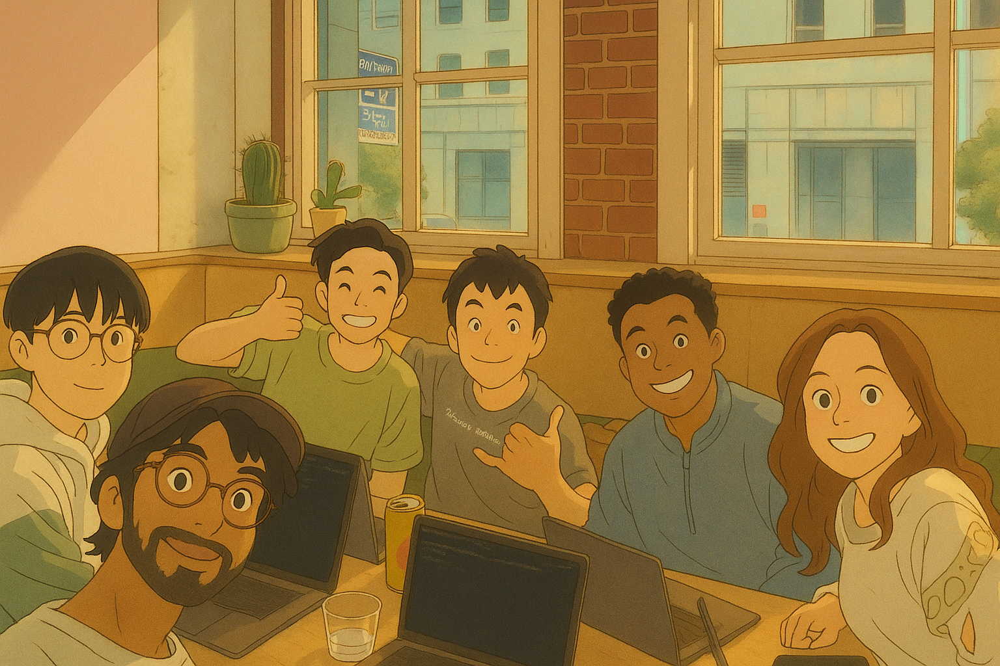

# memoria

## Inspired by
<https://chatgpt.com/share/689a9c79-c7e0-8004-a2e2-74d0d89a79f2>

## Chars

## Team Members

- Huan <https://github.com/huan> Yay~
- Xinyu <https://www.linkedin.com/in/zhxy/> 
- Jai <https://www.linkedin.com/in/jai-d>

