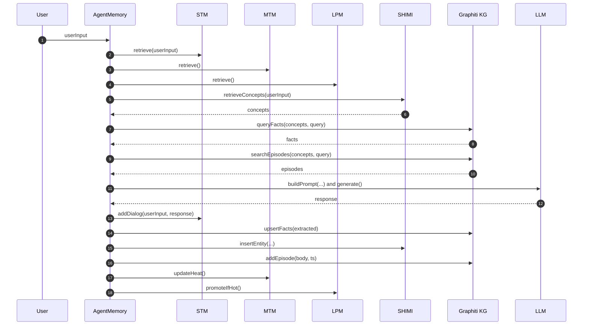

# memoria

## Inspired by
<https://chatgpt.com/share/689a9c79-c7e0-8004-a2e2-74d0d89a79f2>

## Concepts

Here’s an enhanced TypeScript memory orchestrator module that seamlessly stitches together MemoryOS, SHIMI, a Graphiti-based Knowledge Graph (KG), and a fully integrated episodic archive. It includes a heat-decay-based scheduling system to promote mid‑term memory segments into long‑term store and episodic linking of conversations directly into the KG.

1. 🏗️ Unified Architecture (Enhanced)

```text
User Input → Memory Orchestrator Module
 ├─ STM (dialog pages)
 ├─ MTM (segment summaries with heat scores)
 ├─ LPM (long-term personal memory summaries)
 ├─ SHIMI semantic hierarchy
 └─ Graphiti KG (temporal, storing both facts and episodes)
     └→ Episodes are linked to entity nodes
Prompt Context ← Retrieved segments + SHIMI concepts + KG facts + episodes
 → LLM → Response
Then postprocessing updates:
 ├→ STM→MTM heat promotion
 ├→ SHIMI insertion
 ├→ KG upsert facts & add episodic node
```

2. 🔧 TypeScript: Full Integration Example

```ts
// agentMemory.ts
import Graphiti from 'graphiti';
import { SHIMITree } from './shimi';
import { MemoryOS, MemoryPage } from './memoryOS';

export class AgentMemory {
  kg = new Graphiti({ /* config */ });
  shimi = new SHIMITree('root');
  memos = new MemoryOS();

  async handleInput(userInput: string): Promise<string> {
    const ctx = this.memos.retrieve(userInput);

    // Semantic concepts via SHIMI
    const concepts = this.shimi.retrieveConcepts(userInput);

    // KG: fetch relevant facts & episodic nodes
    const facts = await this.kg.queryFacts({
      concepts: concepts.map(c => c.summary),
      query: userInput
    });
    const episodes = await this.kg.searchEpisodes({
      concepts: concepts.map(c => c.summary),
      query: userInput
    });

    const prompt = this.buildPrompt(userInput, { ctx, concepts, facts, episodes });
    const response = await callLLM(prompt);

    // Memory updates
    this.memos.addDialog(userInput, response);
    const newFacts = extractFacts(response);
    await this.kg.upsertFacts(newFacts);

    const newEntities = extractEntities(response);
    newEntities.forEach(ent => this.shimi.insertEntity(ent.summary, ent.id));

    await this.kg.addEpisode({
      name: `episode-${Date.now()}`,
      body: `${userInput}\n${response}`,
      referenceTime: new Date(),
      source: 'conversation'
    });

    this.memos.promoteMTMToLPM();

    return response;
  }

  private buildPrompt(userInput: string, data: any): string {
    const { ctx, concepts, facts, episodes } = data;
    return `
System Memory:
<STM>
${ctx.stm.map((p: MemoryPage) => p.response).join('\n')}
<Mid‑Term>
${ctx.mtm.join('\n')}
<Long‑Term>
${ctx.lpm.map((seg: any) => seg.summary).join('\n')}
<Facts>
${facts.join('\n')}
<Episodes>
${episodes.map((e: any) => e.body).join('\n')}
<Concepts>
${concepts.map(c => c.summary).join(', ')}

User: ${userInput}
Assistant:
`;
  }
}
// assume callLLM, extractFacts, extractEntities are LLM‑powered utilities
```

3. 🧠 Key Design Highlights

**Episodic Archive Integration**
	•	Each conversation turn is stored in Graphiti as an episode node, with full text and metadata.
	•	Episodes link to entity nodes via semantic edges, enabling bidirectional traversal between facts and their conversational origins   .

**Heat‑Decay Scheduling for MTM → LPM**
	•	Mid‑term memory segments receive heat scores based on retrieval frequency, recency, and length.
	•	Segments exceed a threshold are promoted to long‑term persona memory (LPM), while stale ones are evicted or deprioritized  .

**Temporal KG with Graphiti**
	•	Graphiti supports incremental ingestion, temporal edges (valid_at, invalid_at), and episode linking directly into the KG—ideal for evolving agent memory   .
	•	Enables reasoning about entity changes over time and retrieving “past episodes where that entity was discussed”  .

4. 📋 Recap Table

| Component             | Purpose                              | Highlights                                               |
|-----------------------|--------------------------------------|----------------------------------------------------------|
| STM (MemoryOS)        | Active dialogue page buffer          | Keeps last N user/assistant turns                        |
| MTM (MemoryOS)        | Summarized segments with heat scores | Promotes frequent segments to LPM                        |
| LPM (MemoryOS)        | Long-term personal memory            | Stable persona/preferences store                         |
| SHIMI Tree            | Semantic concept hierarchy           | Guides which concepts to query KG or episodes            |
| Graphiti Knowledge Graph | Facts & episodic conversation storage | Temporal reasoning + episode linkage                     |
| Heat-decay scheduler  | Segment promotion/eviction           | Balances memory capacity & relevance                     |

5. 🎯 Why It Matters

	•	MemoryOS provides structured lifecycle (STM → MTM → LPM) for efficient retention of dialogue and context        .
	•	SHIMI ensures retrieval is semantically focused, narrowing down scope and guiding KG queries.
	•	Graphiti brings temporally anchored knowledge, linking episodes and facts for explainable recall  .
	•	Heat scheduling avoids memory bloat, preserving only high-value segments into LPM.
	•	Episodic archive ensures continuity and referenceability across sessions with full context linkage.

## Chars

### 1) Flow of data through the Memory Agent (architecture)


### 2) Turn-by-turn sequence for handleInput(...)



## Weaviate
Cluster: memoria-hackathon-cluster
REST Endpoint: 52kvy1rz6yu15gjx9x5g.c0.us-west3.gcp.weaviate.cloud

## Team Members

- Huan <https://github.com/huan> Yay~
- Xinyu <https://www.linkedin.com/in/zhxy/> 
- Jai <https://www.linkedin.com/in/jai-d>


