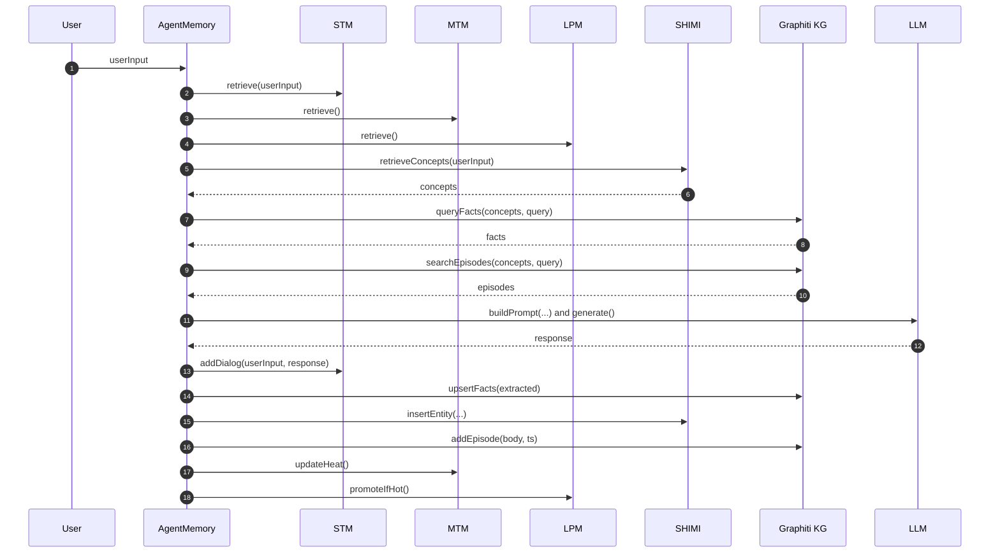

# memoria

## Inspired by
<https://chatgpt.com/share/689a9c79-c7e0-8004-a2e2-74d0d89a79f2>

## Chars

### 1) Flow of data through the Memory Agent (architecture)

```mermaid
flowchart TB
  U([User Input])
  O{{Memory Orchestrator}}

  subgraph Stores
    direction TB
    STM[(STM<br/>Dialog Pages)]
    MTM[(MTM<br/>Summarized Segments + Heat)]
    LPM[(LPM<br/>Long-Term Persona)]
    SHIMI[[SHIMI<br/>Semantic Tree]]
    KG[(Graphiti Temporal KG<br/>&#40;Facts + Episodes&#41;<br/>Episodes ↔ Entities)]
  end

  U --> O
  O -->|retrieve| STM
  O -->|retrieve| MTM
  O -->|retrieve| LPM
  O -->|retrieve concepts| SHIMI
  O -->|query facts + episodes| KG

  C[[Assemble Prompt Context]]
  STM --> C
  MTM --> C
  LPM --> C
  SHIMI --> C
  KG --> C

  C --> LLM[[LLM]]
  LLM --> R([Agent Response])
  R --> O

  O -->|addDialog| STM
  O -->|segment + update heat| MTM
  O -->|promote if hot| LPM
  O -->|insert concepts| SHIMI
  O -->|upsert facts + add episode| KG
```

### 2) Turn-by-turn sequence for handleInput(...)

## Weaviate
Cluster: memoria-hackathon-cluster
REST Endpoint: 52kvy1rz6yu15gjx9x5g.c0.us-west3.gcp.weaviate.cloud

## Team Members

- Huan <https://github.com/huan> Yay~
- Xinyu <https://www.linkedin.com/in/zhxy/> 
- Jai <https://www.linkedin.com/in/jai-d>

